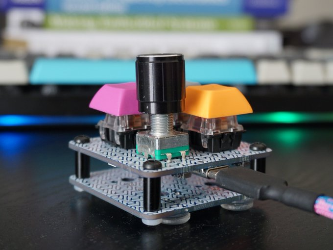

# macro4 - A small macro pad

Status: V0.2 tested and working

Features:
- 2x2 layout with encoder support on top locations
- STM32F072 with Type C connector
- Somewhat cost optimised / JLCSMT optimised design

